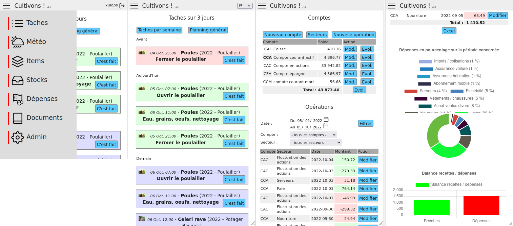

<!--
N.B.: This README was automatically generated by <https://github.com/YunoHost/apps/tree/master/tools/readme_generator>
It shall NOT be edited by hand.
-->

# Cultivons for YunoHost

[](https://ci-apps.yunohost.org/ci/apps/cultivons/)  

[](https://install-app.yunohost.org/?app=cultivons)

*[Read this README in other languages.](./ALL_README.md)*

> *This package allows you to install Cultivons quickly and simply on a YunoHost server.*  
> *If you don't have YunoHost, please consult [the guide](https://yunohost.org/install) to learn how to install it.*

## Overview

__Cultivons!__ is a software in the form of an internal site aiming at helping the management of a BAD (Sustainable Autonomous Base).

A BAD is a place where one or more people can (over)live a disaster (natural, plague, war, economic collapse ... put here the reason that pleases you or scares you the most), for a more or less long period of time, without needing the outside: supermarkets, hospitals, and other services present in a modern society.

This definition is a little broad, in fact a BAD will often materialize by a place in the countryside where one will try to be as autonomous as possible on the most important aspects of survival:

* food (vegetable garden, orchard, animals... everything that is culture and breeding);
* electricity;
* water (including potabilization);
* heating;
* first aid;
* storage of recipes, guides and other documentation...

With __cultivons!__, you can manage 
- your crops, your garden and the associated tasks (semi, harvest) as well as garden plan.
- the weather,
- the stocks,
- your documents,
- your budget (Bank Account).

### Articles
- https://linuxfr.org/users/xulops/journaux/cultivons-logiciel-de-gestion-de-bad


**Shipped version:** 1.9~ynh2

**Demo:** <https://cultivons-demo.xulops.net>

## Screenshots



## Documentation and resources

- Official app website: <https://xulops.net/forge/cultivons.php>
- Official user documentation: <https://xulops.net/forge/cultivons.php?menu=about>
- Official admin documentation: <https://xulops.net/forge/cultivons.php?menu=about>
- Upstream app code repository: <https://xulops.net/forge/cultivons.php?menu=download>
- YunoHost Store: <https://apps.yunohost.org/app/cultivons>
- Report a bug: <https://github.com/YunoHost-Apps/cultivons_ynh/issues>

## Developer info

Please send your pull request to the [`testing` branch](https://github.com/YunoHost-Apps/cultivons_ynh/tree/testing).

To try the `testing` branch, please proceed like that:

```bash
sudo yunohost app install https://github.com/YunoHost-Apps/cultivons_ynh/tree/testing --debug
or
sudo yunohost app upgrade cultivons -u https://github.com/YunoHost-Apps/cultivons_ynh/tree/testing --debug
```

**More info regarding app packaging:** <https://yunohost.org/packaging_apps>
