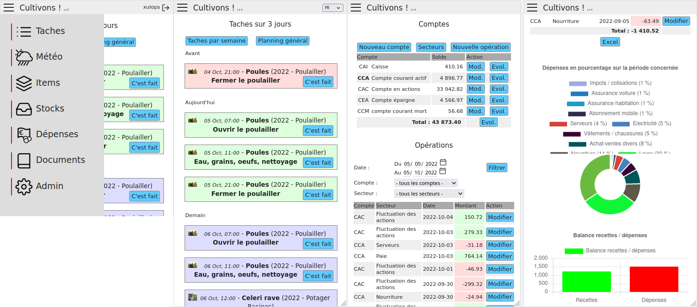

<!--
注意：此 README 由 <https://github.com/YunoHost/apps/tree/master/tools/readme_generator> 自动生成
请勿手动编辑。
-->

# YunoHost 上的 Cultivons

[](https://ci-apps.yunohost.org/ci/apps/cultivons/)  

[](https://install-app.yunohost.org/?app=cultivons)

*[阅读此 README 的其它语言版本。](./ALL_README.md)*

> *通过此软件包，您可以在 YunoHost 服务器上快速、简单地安装 Cultivons。*  
> *如果您还没有 YunoHost，请参阅[指南](https://yunohost.org/install)了解如何安装它。*

## 概况

__Cultivons!__ is a software in the form of an internal site aiming at helping the management of a BAD (Sustainable Autonomous Base).

A BAD is a place where one or more people can (over)live a disaster (natural, plague, war, economic collapse ... put here the reason that pleases you or scares you the most), for a more or less long period of time, without needing the outside: supermarkets, hospitals, and other services present in a modern society.

This definition is a little broad, in fact a BAD will often materialize by a place in the countryside where one will try to be as autonomous as possible on the most important aspects of survival:

* food (vegetable garden, orchard, animals... everything that is culture and breeding);
* electricity;
* water (including potabilization);
* heating;
* first aid;
* storage of recipes, guides and other documentation...

With __cultivons!__, you can manage 
- your crops, your garden and the associated tasks (semi, harvest) as well as garden plan.
- the weather,
- the stocks,
- your documents,
- your budget (Bank Account).

### Articles
- https://linuxfr.org/users/xulops/journaux/cultivons-logiciel-de-gestion-de-bad


**分发版本：** 1.9~ynh1

**演示：** <https://cultivons-demo.xulops.net>

## 截图



## 文档与资源

- 官方应用网站： <https://xulops.net/forge/cultivons.php>
- 官方用户文档： <https://xulops.net/forge/cultivons.php?menu=about>
- 官方管理文档： <https://xulops.net/forge/cultivons.php?menu=about>
- 上游应用代码库： <https://xulops.net/forge/cultivons.php?menu=download>
- YunoHost 商店： <https://apps.yunohost.org/app/cultivons>
- 报告 bug： <https://github.com/YunoHost-Apps/cultivons_ynh/issues>

## 开发者信息

请向 [`testing` 分支](https://github.com/YunoHost-Apps/cultivons_ynh/tree/testing) 发送拉取请求。

如要尝试 `testing` 分支，请这样操作：

```bash
sudo yunohost app install https://github.com/YunoHost-Apps/cultivons_ynh/tree/testing --debug
或
sudo yunohost app upgrade cultivons -u https://github.com/YunoHost-Apps/cultivons_ynh/tree/testing --debug
```

**有关应用打包的更多信息：** <https://yunohost.org/packaging_apps>
